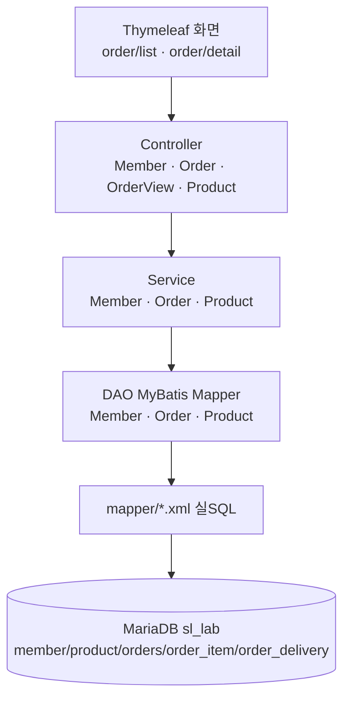

# SAD — sl-shop (shop-api)

## 1. 아키텍처 패턴

n-tier(3계층) — `@RestController`/`@Controller` → `@Service` → MyBatis `@Mapper`(XML SQL).
근거: `com.sm.lab.shop.{controller,service,dao,domain}` 패키지 4분할(계층별), 트랜잭션 경계는
서비스 계층. 컨트롤러는 Member/Order/OrderView/Product 4개로 REST API(회원·주문·상품)와
Thymeleaf 화면 뷰(주문 목록/상세)가 공존한다.

## 2. 레이어 구조

## 3. 도메인 구성

| 도메인 | 설명 | 주요 레이어 | rootPath |
|--------|------|------------|---------|
| order | 주문 생성·조회·취소·배송, 회원/상품 참조를 포함한 단일 도메인 | controller/service/dao/domain | src/main/java/com/sm/lab/shop/, src/main/resources/ |

> **도메인 분리 재검토 메모**: 컨트롤러 구성(Member/Order/Product)만 보면 회원(MBR)·주문(ORD)·
> 상품(PRD) 3개 도메인 분리가 자연스러워 보이지만, 실제 소스는 `controller/`, `service/`,
> `dao/`, `domain/` 4개 디렉토리 아래 세 엔티티가 전부 flat하게 함께 배치된
> **layer-by-type(계층별) 구조**이며 도메인별 하위 디렉토리가 없다. 본 플러그인의 도메인 매칭
> 기법(`in_roots`, `skills/sl-recon-inf/SKILL.md`)은 `rootPaths` 접두어(prefix) 매칭만 지원하므로,
> 3개 도메인에 (구분할 하위 경로가 없어) 같은 경로를 배정하면 3개 도메인이 동일한 17개 파일을
> 전부 중복 매칭하게 되어 기계적으로 성립하지 않는다. 또한 파일수 기준(10개 미만 인접 도메인
> 흡수)으로도 Member(4개)·Product(4개)는 흡수 대상이다. 따라서 이번 스캔에서는 실제 디렉토리
> 구조를 정본으로 삼아 **order 단일 도메인**으로 확정한다(기존 plan과 동일 결론, 재검증 완료).

## 4. 기술 스택

Java 17 / Spring Boot 3.3.5 / MyBatis 3.0.3 / Thymeleaf / MariaDB 11.4 (포트 3307, 스키마 sl_lab)
