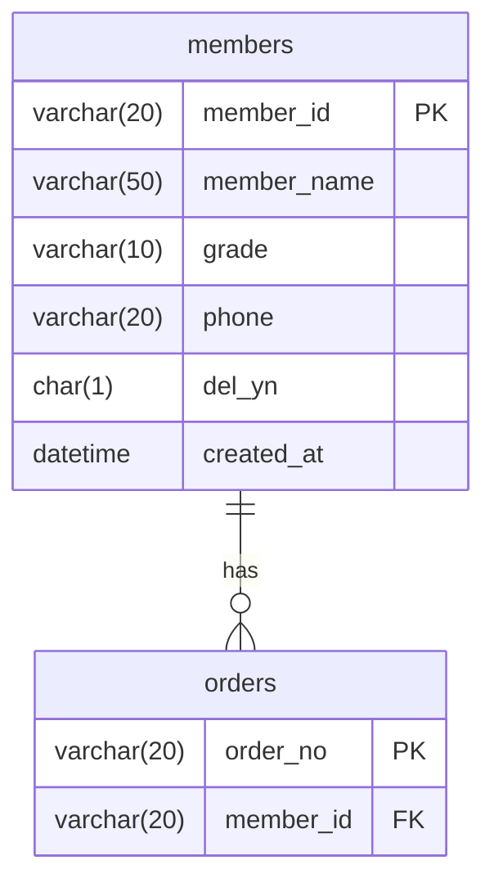

# SCH-ORD-001: members

> **FUNC-ID:** [TBD] | **SRS-F:** [TBD] | **API:** [TBD] | **화면:** [TBD]

**근거 소스:** `DB 실측(db-main MCP describe)` — 컬럼 타입·NULL·기본값은 MariaDB(sl_lab) 실스키마 조회로 사실화(P1/SR-202 enrichment). [미확인] 헤더 잔존은 자기모순이라 정정(OBS-018, 2026-08-23)

### 컬럼 설명
| 컬럼명 | 타입 | NULL | 키 | 기본값 | 설명 |
|--------|------|------|----|--------|------|
| member_id | VARCHAR(20) | N | PK | — | 회원 ID (M-접두) |
| member_name | VARCHAR(50) | N |  | — | 회원명 |
| grade | VARCHAR(10) | N |  | BRONZE | 등급 (BRONZE/SILVER/GOLD/VIP) |
| phone | VARCHAR(20) | Y |  | NULL | 휴대폰 |
| del_yn | CHAR(1) | N |  | N | 탈퇴 여부 (soft delete) |
| created_at | DATETIME | N |  | CURRENT_TIMESTAMP | 가입일시 |

### 인덱스
| 인덱스명 | 컬럼 | 타입 | 목적 |
|---------|------|------|------|
| — | — | — | — |

### 코드값

**grade (등급)**
| 값 | 의미 | 비고 |
|----|------|------|
| BRONZE | 일반 회원 | INF-ORD-001 응답 예시 |
| SILVER | 실버 회원 | INF-ORD-001 응답 예시 |
| GOLD | 골드 회원 | INF-ORD-001 응답 예시 |
| VIP | VIP 회원 | INF-ORD-001 응답 예시 |

### 관계 (FK / 관찰된 조인)
| 자식 컬럼 | 참조 테이블 | 참조 컬럼 | 출처 | ON DELETE |
|---------|-----------|---------|------|----------|
| member_id | ORDERS | member_id | 쿼리관찰(4) | — |

> 출처 `DB FK`=DB 선언 제약, `쿼리관찰(N)`=소스 SQL에서 N회 등장한 등가조인(논리 FK).

🔧 쿼리 작성 가이드 — 상시 필터 (관찰 1건)

> 이 테이블 조회 시 코드에서 반복 관찰된 술어. AIDD 쿼리 생성 시 누락하면 결과가 틀어진다.

| 컬럼 | 조건 | 빈도 | 의미 | 출처 |
|------|------|------|------|------|
| DEL_YN | = 'N' | 4 | 탈퇴하지 않은 회원만 조회(soft-delete 행 제외) | member.xml |

### mini-ERD

### 비즈니스 주의사항

- 탈퇴 회원(`del_yn = 'Y'`)은 조회 시 모든 API에서 자동으로 필터됨([[INF-ORD-001]], [[INF-ORD-002]])
- 모든 조회 쿼리에서 `del_yn = 'N'` 상시필터 적용 — 누락 시 탈퇴 회원도 노출
