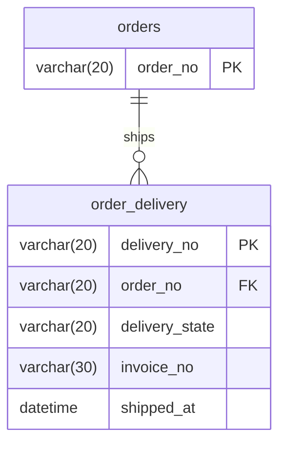

# SCH-ORD-002: order_delivery

> **FUNC-ID:** [TBD] | **SRS-F:** [TBD] | **API:** [TBD] | **화면:** [TBD]

**근거 소스:** `DB 실측(db-main MCP describe)` — 컬럼 타입·NULL·기본값은 MariaDB(sl_lab) 실스키마 조회로 사실화(P1/SR-202 enrichment). [미확인] 헤더 잔존은 자기모순이라 정정(OBS-018, 2026-08-23)

### 컬럼 설명
| 컬럼명 | 타입 | NULL | 키 | 기본값 | 설명 |
|--------|------|------|----|--------|------|
| delivery_no | VARCHAR(20) | N | PK | — | 배송번호 |
| order_no | VARCHAR(20) | N |  | — | 주문번호 |
| delivery_state | VARCHAR(20) | N |  | READY | 배송 상태 (READY/SHIPPED/DELIVERED/CANCELED) |
| invoice_no | VARCHAR(30) | Y |  | NULL | 송장번호 |
| shipped_at | DATETIME | Y |  | NULL | 출고일시 |

### 인덱스
| 인덱스명 | 컬럼 | 타입 | 목적 |
|---------|------|------|------|
| — | — | — | — |

### 코드값

**delivery_state (배송 상태)**
| 값 | 의미 | 비고 |
|----|------|------|
| READY | 배송 준비 | 초기 상태, 송장 미할당 |
| SHIPPED | 배송중 | 송장번호 할당, shipped_at 기록 |
| DELIVERED | 배송 완료 | 고객 수령 |
| CANCELED | 배송 취소 | 주문 취소 시 |

### 관계 (FK / 관찰된 조인)
| 자식 컬럼 | 참조 테이블 | 참조 컬럼 | 출처 | ON DELETE |
|---------|-----------|---------|------|----------|
| order_no | ORDERS | order_no | INF-ORD-004 | — |

> 출처 `DB FK`=DB 선언 제약, `쿼리관찰(N)`=소스 SQL에서 N회 등장한 등가조인(논리 FK).

### mini-ERD

### 비즈니스 주의사항

- 배송은 주문 생성 후 자동으로 생성되지 않음([[INF-ORD-004]] 응답에서 `deliveries`는 존재하지 않는 경우가 대부분)
- `delivery_state = 'READY'`일 때는 `invoice_no`와 `shipped_at`이 NULL
- 배송이 시작되면 `invoice_no` 할당 및 `shipped_at` 기록 — AIDD 쿼리 생성 시 `shipped_at` NULL 체크 필요
