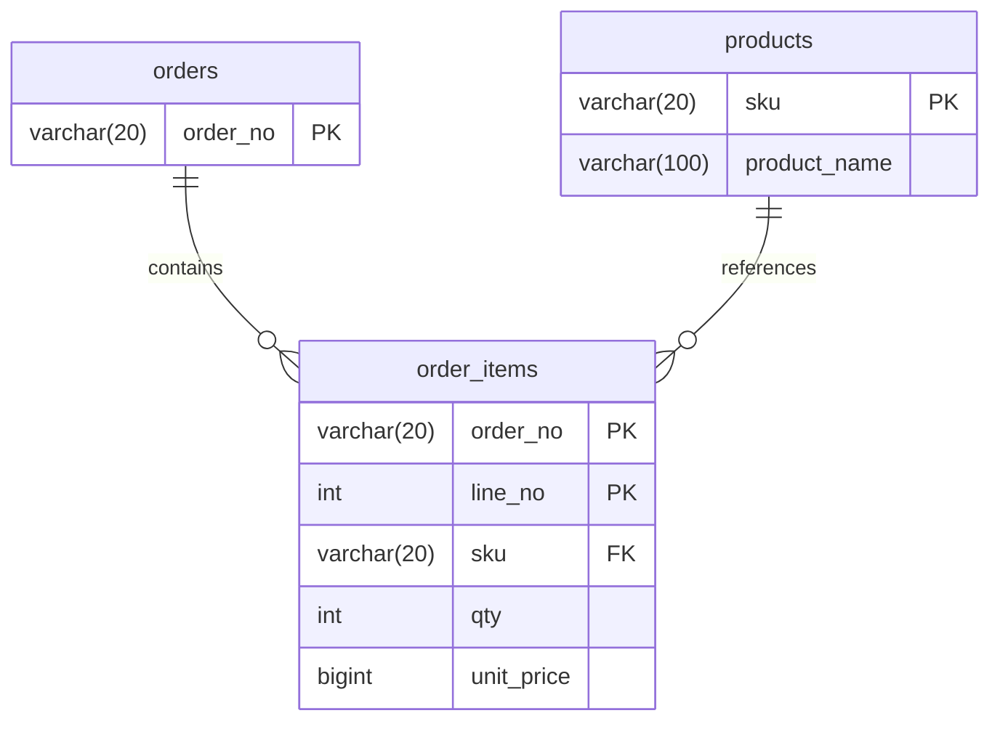

# SCH-ORD-003: order_items

> **FUNC-ID:** [TBD] | **SRS-F:** [TBD] | **API:** [TBD] | **화면:** [TBD]

**근거 소스:** `DB 실측(db-main MCP describe)` — 컬럼 타입·NULL·기본값은 MariaDB(sl_lab) 실스키마 조회로 사실화(P1/SR-202 enrichment). [미확인] 헤더 잔존은 자기모순이라 정정(OBS-018, 2026-08-23)

### 컬럼 설명
| 컬럼명 | 타입 | NULL | 키 | 기본값 | 설명 |
|--------|------|------|----|--------|------|
| order_no | VARCHAR(20) | N | PK | — | 주문번호 |
| line_no | INT(11) | N | PK | — | 주문 라인 번호 |
| sku | VARCHAR(20) | N |  | — | 상품 SKU |
| qty | INT(11) | N |  | — | 수량 |
| unit_price | BIGINT(20) | N |  | — | 주문 시점 단가(원) |

### 인덱스
| 인덱스명 | 컬럼 | 타입 | 목적 |
|---------|------|------|------|
| — | — | — | — |

### 관계 (FK / 관찰된 조인)
| 자식 컬럼 | 참조 테이블 | 참조 컬럼 | 출처 | ON DELETE |
|---------|-----------|---------|------|----------|
| order_no | ORDERS | order_no | INF-ORD-004 | — |
| sku | PRODUCTS | sku | 쿼리관찰(2) | — |

> 출처 `DB FK`=DB 선언 제약, `쿼리관찰(N)`=소스 SQL에서 N회 등장한 등가조인(논리 FK).

### mini-ERD

### 비즈니스 주의사항

- 복합 PK: `(order_no, line_no)` — 같은 주문 내에서 라인 번호로 중복 방지([[INF-ORD-004]] 응답의 `items` 배열에서 순서 유지)
- `unit_price`는 **주문 시점의 상품 가격**을 고정 기록 — 현재 `PRODUCTS.price`와 다를 수 있음([[INF-ORD-005]] 트랜잭션 순서에서 "라인별로 PRODUCTS 조회 → 재고 차감")
- 주문 생성 후 라인별 `productName` 조회는 `JOIN PRODUCTS ON ORDER_ITEMS.sku = PRODUCTS.sku`([[INF-ORD-004]])
