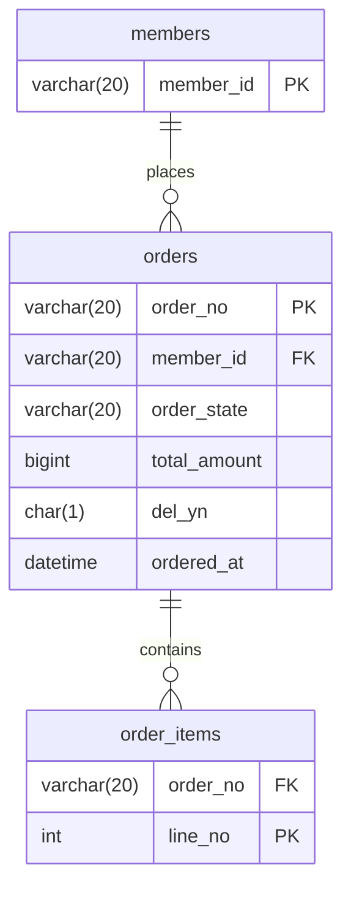

# SCH-ORD-004: orders

> **FUNC-ID:** [TBD] | **SRS-F:** [TBD] | **API:** [TBD] | **화면:** [TBD]

**근거 소스:** `DB 실측(db-main MCP describe)` — 컬럼 타입·NULL·기본값은 MariaDB(sl_lab) 실스키마 조회로 사실화(P1/SR-202 enrichment). [미확인] 헤더 잔존은 자기모순이라 정정(OBS-018, 2026-08-23)

### 컬럼 설명
| 컬럼명 | 타입 | NULL | 키 | 기본값 | 설명 |
|--------|------|------|----|--------|------|
| order_no | VARCHAR(20) | N | PK | — | 주문번호 (yyyymmdd+seq) |
| member_id | VARCHAR(20) | N |  | — | 주문 회원 |
| order_state | VARCHAR(20) | N |  | PLACED | 상태 (PLACED/PAID/SHIPPED/PARTIAL_SHIPPED/CANCELED/DONE) |
| total_amount | BIGINT(20) | N |  | — | 주문 총액(원) |
| del_yn | CHAR(1) | N |  | N | 논리 삭제 (soft delete) |
| ordered_at | DATETIME | N |  | CURRENT_TIMESTAMP | 주문일시 |

### 인덱스
| 인덱스명 | 컬럼 | 타입 | 목적 |
|---------|------|------|------|
| — | — | — | — |

### 코드값

**order_state (주문 상태)**
| 값 | 의미 | 비고 |
|----|------|------|
| PLACED | 주문 접수 | 신규 주문 초기 상태([[INF-ORD-005]] 생성 시) |
| PAID | 결제 완료 | 결제 단계([[INF-ORD-003]] 상태 필터) |
| SHIPPED | 배송중 | 전체 아이템 배송 시작 |
| PARTIAL_SHIPPED | 부분 배송 | 일부 아이템만 배송([[INF-ORD-003]] 상태 필터) |
| CANCELED | 주문 취소 | 취소 완료 |
| DONE | 주문 완료 | 모든 배송 완료 |

### 관계 (FK / 관찰된 조인)
| 자식 컬럼 | 참조 테이블 | 참조 컬럼 | 출처 | ON DELETE |
|---------|-----------|---------|------|----------|
| member_id | MEMBERS | member_id | 쿼리관찰(4) | — |

> 출처 `DB FK`=DB 선언 제약, `쿼리관찰(N)`=소스 SQL에서 N회 등장한 등가조인(논리 FK).

🔧 쿼리 작성 가이드 — 상시 필터 (관찰 1건)

> 이 테이블 조회 시 코드에서 반복 관찰된 술어. AIDD 쿼리 생성 시 누락하면 결과가 틀어진다.

| 컬럼 | 조건 | 빈도 | 의미 | 출처 |
|------|------|------|------|------|
| DEL_YN | = 'N' | 8 | 논리삭제된 주문 제외(soft-delete 행 제외) | order.xml |

### mini-ERD

### 비즈니스 주의사항

- 모든 조회 쿼리에서 `del_yn = 'N'` 상시필터 적용([[INF-ORD-003]], [[INF-ORD-004]]) — 논리삭제된 주문 조회 시 404
- `order_no` 채번: `yyyyMMdd-{4자리 시퀀스}` 형식, 시작값 100([[INF-ORD-005]]) — AIDD 쿼리 생성 시 시퀀스 직접 UPDATE 대신 애플리케이션 로직에 의존
- `total_amount`는 각 라인 `unit_price × qty`의 합([INF-ORD-005]]) — DB에서 직접 계산하지 말고 애플리케이션에서 계산해 INSERT
- `member_id` 조인 시 회원이 탈퇴했어도 주문 기록은 유지([[INF-ORD-003]] "회원 미탈퇴 여부와 무관하게 조인만 수행")
