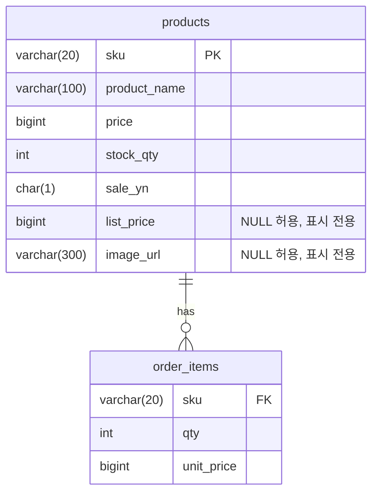

# SCH-ORD-005: products

> **FUNC-ID:** [TBD] | **SRS-F:** [TBD] | **API:** [TBD] | **화면:** [TBD]

**근거 소스:** `DB 실측(db-main MCP describe)` — 컬럼 타입·NULL·기본값은 MariaDB(sl_lab) 실스키마 조회로 사실화(P1/SR-202 enrichment). [미확인] 헤더 잔존은 자기모순이라 정정(OBS-018, 2026-08-23)

### 컬럼 설명
| 컬럼명 | 타입 | NULL | 키 | 기본값 | 설명 |
|--------|------|------|----|--------|------|
| sku | VARCHAR(20) | N | PK | — | 상품 SKU |
| product_name | VARCHAR(100) | N |  | — | 상품명 |
| price | BIGINT(20) | N |  | — | 판매가(원) |
| stock_qty | INT(11) | N |  | 0 | 가용 재고 |
| sale_yn | CHAR(1) | N |  | Y | 판매 여부 |
| list_price | BIGINT(20) | Y |  | NULL | [변경: SR-306] 정가(원, 표시 전용) — `price`와 무관, NULL=정가 없음(화면은 이때 할인 표시를 하지 않는다). 할인율은 저장하지 않고 화면이 `list_price`·`price`로 계산 |
| image_url | VARCHAR(300) | Y |  | NULL | [변경: SR-306] 대표 이미지 경로(앱이 서빙하는 정적 경로, 예: `/images/products/sku-1001.svg`) — 외부 URL 금지, NULL=이미지 없음(화면은 이니셜 대체 영역 표시) |

### 인덱스
| 인덱스명 | 컬럼 | 타입 | 목적 |
|---------|------|------|------|
| — | — | — | — |

### 코드값

**sale_yn (판매 여부)**
| 값 | 의미 | 비고 |
|----|------|------|
| Y | 판매중 | 주문 생성 시 필수([[INF-ORD-005]] 검증 "sale_yn = 'Y'가 아니면 400") |
| N | 판매 중단 | 주문 생성 불가 |

### 관계 (FK / 관찰된 조인)
| 자식 컬럼 | 참조 테이블 | 참조 컬럼 | 출처 | ON DELETE |
|---------|-----------|---------|------|----------|
| sku | ORDER_ITEMS | sku | 쿼리관찰(2) | — |

> 출처 `DB FK`=DB 선언 제약, `쿼리관찰(N)`=소스 SQL에서 N회 등장한 등가조인(논리 FK).

🔧 쿼리 작성 가이드 — 상시 필터 (관찰 1건)

> 이 테이블 조회 시 코드에서 반복 관찰된 술어. AIDD 쿼리 생성 시 누락하면 결과가 틀어진다.

| 컬럼 | 조건 | 빈도 | 의미 | 출처 |
|------|------|------|------|------|
| SALE_YN | = 'Y' | 2 | 판매중인 상품만 조회(판매 중단 상품 제외) | product.xml |

### mini-ERD

### 비즈니스 주의사항

- 주문 생성 시 상품 검증: `sale_yn = 'Y'`가 아니면 400 오류([[INF-ORD-005]]) — AIDD 쿼리 생성 시 필수 필터
- 재고 차감: 조건부 UPDATE `WHERE stock_qty >= qty` 사용 — 동시 주문 시 데이터베이스 레벨 동시성 가드([[INF-ORD-005]] "재고 부족으로 409")
- `price`는 현재 판매가 — `ORDER_ITEMS.unit_price`는 주문 시점의 가격을 별도 기록([[INF-ORD-004]] 상세 조회 시 과거 단가 표시)
- `stock_qty` UPDATE는 AIDD 쿼리 생성 시 직접 위임 안 함 — 동시성 문제 방지 위해 애플리케이션이 주도
- [변경: SR-306] `list_price`·`image_url`은 런타임 쓰기 경로가 없다(시드로만 채워짐) — 주문·정산·통계 등 타 도메인 조인·집계는 이 두 컬럼을 읽지 않고 `price`만 쓴다(표시 전용, 파급 없음)

## 변경 이력
<!-- spec-history: machine-managed -->
| 일자 | SR | 항목 | 변경 요약 | 커밋 |
|---|---|---|---|---|
| 2026-09-17 | SR-306 | #2 | list_price·image_url 컬럼 추가(둘 다 NULL 허용, 표시 전용, 런타임 쓰기 없음) | shop-api@7eebc9f, shop-api@e1d18da, shop-web@cbe9816 |
