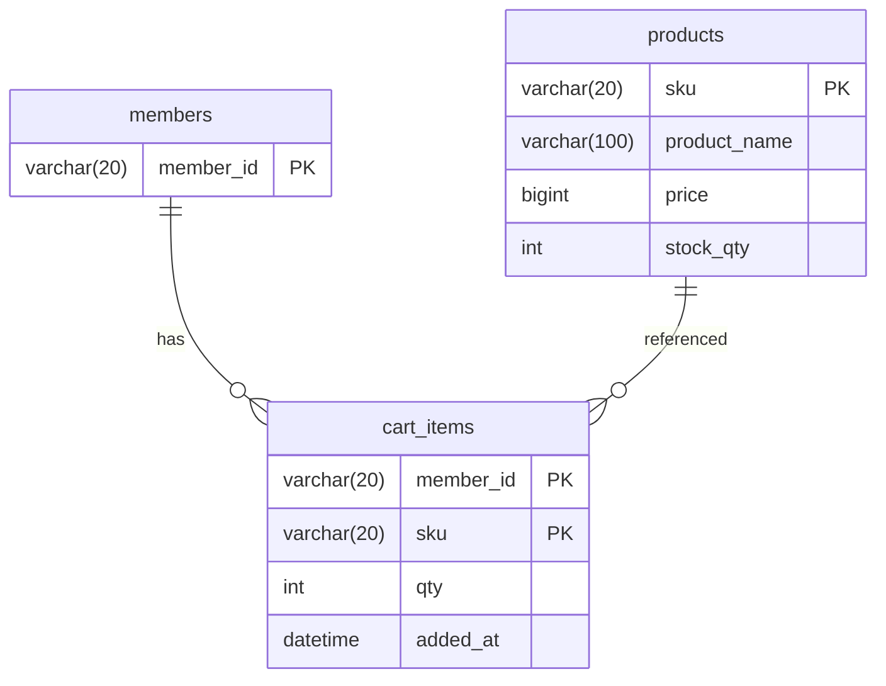

# SCH-ORD-006: cart_items

> **FUNC-ID:** [TBD] | **SRS-F:** [TBD] | **API:** [INF-ORD-010](../INF/INF-ORD-010.md), [INF-ORD-011](../INF/INF-ORD-011.md), [INF-ORD-012](../INF/INF-ORD-012.md), [INF-ORD-013](../INF/INF-ORD-013.md) | **화면:** [TBD]

**근거 소스:** `src/main/java/com/sm/lab/shop/controller/CartController.java` + `src/main/resources/mapper/cart.xml`

### 컬럼 설명
| 컬럼명 | 타입 | NULL | 키 | 기본값 | 설명 |
|--------|------|------|----|--------|------|
| member_id | VARCHAR(20) | N | PK | — | 회원 ID (M-접두) |
| sku | VARCHAR(20) | N | PK | — | 상품 SKU |
| qty | INT(11) | N |  | — | 장바구니 수량 |
| added_at | DATETIME | N |  | CURRENT_TIMESTAMP | 장바구니 담은 날짜시간 |

### 인덱스
| 인덱스명 | 컬럼 | 타입 | 목적 |
|---------|------|------|------|
| idx_cart_items_added_at | added_at | — | 담은 순 정렬([[INF-ORD-011]] 응답에서 `added_at, sku` 순 정렬) |

### 관계 (FK / 관찰된 조인)
| 자식 컬럼 | 참조 테이블 | 참조 컬럼 | 출처 | ON DELETE |
|---------|-----------|---------|------|----------|
| member_id | MEMBERS | member_id | INF-ORD-010 | — |
| sku | PRODUCTS | sku | 쿼리관찰(4) | — |

> 출처 `DB FK`=DB 선언 제약, `쿼리관찰(N)`=소스 SQL에서 N회 등장한 등가조인(논리 FK).

### mini-ERD

### 비즈니스 주의사항

- 복합 PK: `(member_id, sku)` — 같은 상품의 재담기는 UPSERT로 수량 합산([[INF-ORD-010]] "INSERT ... ON DUPLICATE KEY UPDATE qty = qty + VALUES(qty)")
- 응답의 `productName`, `price`, `lineTotal`은 테이블 컬럼이 아니라 애플리케이션이 JOIN PRODUCTS로 조회 후 계산해서 제공([[INF-ORD-011]] "`totalAmount`는 각 품목의 `price × qty` 합계로, 조회 시점에 애플리케이션에서 계산")
- 판매중지(`PRODUCTS.sale_yn='N'`) 상품은 담기 거부(409 — [[INF-ORD-010]])
- 품절(`PRODUCTS.stock_qty=0`)은 담기 전 조기 거부(409 — [[INF-ORD-010]])
- 담기는 상품 재고를 직접 차감하지 않음([[INF-ORD-010]] "담기는 재고를 차감하지 않는다(보관 전용)")
- 품목 삭제는 명시적 DELETE만 가능, qty를 0으로 변경할 수 없음([[INF-ORD-012]] "qty < 1은 400으로 거부한다 — 삭제는 명시적 DELETE로만 수행")
