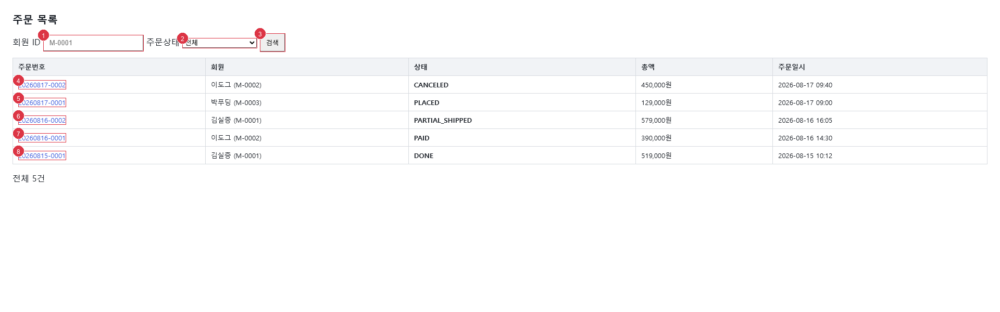

# UIS-ORD-001: 주문 목록

> **근거 소스(권위):** `src/main/resources/templates/order/list.html` +
> `src/main/java/com/sm/lab/shop/controller/OrderViewController.java`. 소스폴백 모드(스크린샷 없음).

## 1. 화면 목적

회원 ID·주문상태·조회기간(시작일~종료일)으로 주문 내역을 검색하고, 주문번호·회원·상태·총액·주문일시·배송상태를 목록으로 조회하는 화면이다. 각 주문번호는 주문 상세 화면으로 연결된다.

> **배송상태(6번째 열, SR-210 추가):** 값은 해당 주문의 **최신 배송 이력 상태**이며, 배송 이력이 없으면 "-"로 표시한다. INF-ORD-003(GET /api/orders) 응답 계약은 바뀌지 않는다(확정 문답 scope_freeze, api_compat) — 이 값은 REST API 응답이 아니라 화면 조회 경로(`OrderViewController.orderList` → `OrderService.latestDeliveryStatesByOrderNo`)에서 별도로 조합된다. "최신"은 배송 이력이 가장 최근에 **생성된** 건을 의미하며(배송 이력 생성 순서 = `delivery_no` DESC 단독 기준 — `ORDER_DELIVERY`에 별도 등록시각 컬럼이 없어 배송번호 발번 순서를 대리 지표로 사용), 출고일시(`shipped_at`) 기준이 아니다. 이 정의는 FUNC-order-006(주문 상세 화면의 배송 이력 정렬)과 다르다 — 그 화면은 출고일시(shipped_at) 기준 정렬이 목적에 맞지만, 이 화면은 미출고(READY, shipped_at NULL) 건이 더 나중에 생성됐어도 항상 뒤로 밀리는 결함이 있어 별도로 재정의했다.

## 2. 주요 작업 시나리오

**시나리오: 주문 목록 조회**
1. 회원 ID(`memberId`), 주문상태(`orderState`), 시작일(`startDate`)·종료일(`endDate`)을 필요한 만큼 입력한다(모두 선택 입력).
2. [검색] 버튼(`#btnSearch`)을 눌러 `GET /order/list`로 재요청한다 — 입력한 조건은 모두 AND로 결합된다.
3. 조회 결과가 표에 채워지고, 총 건수가 하단에 표시된다. 결과가 0건이면 "조회 결과 없음" 안내가 표시된다.
4. 조회 구간이 역전(시작일 > 종료일) 등으로 서버가 4xx를 반환하면, 화면 상단에 "조회 실패: {사유}" 오류 배너만 표시되고 주문목록 그리드·"조회 결과 없음" 안내·"전체 N건" 총건수 라벨은 모두 숨겨진다(5xx는 그대로 전파되어 이 화면에서 흡수하지 않음).
5. 목록의 주문번호 링크를 클릭하면 `/order/{orderNo}` 주문 상세 화면으로 이동한다.

## 3. 화면 구성 (블록)

| 마커 | 블록 | 역할 | 주요 위젯 | 소스 근거 |
|---|------|------|----------|----------|
| ① | 오류 배너 | 4xx 조회 실패 안내(조건부 표시) | 안내 문구 | `list.html:25-27` |
| ② | 검색조건 | 회원ID·주문상태·조회기간 필터 | memberId, orderState, startDate, endDate, 검색 버튼 | `list.html:28-44` |
| ③ | 주문목록 그리드 | 조회결과 표시(4xx 시 숨김) | 주문번호 링크, 회원, 상태, 총액, 주문일시, **배송상태(SR-210)** | `list.html:51-65` |
| ④ | 결과 요약 | 빈 결과 안내 + 전체 건수(4xx 시 숨김) | 안내 문구, 전체 건수 | `list.html:68-70` |

## 4. 위젯·액션

**② 검색조건**

| 번호 | 위젯 | 타입 | 레이블 | 동작 | 연결 API(raw) | 결과 |
|---|------|------|--------|------|--------------|------|
| (1) | `memberId` | input(text) | 회원 ID | 검색 파라미터 입력 | — | — |
| (2) | `#selState` (`orderState`) | select | 주문상태 | 전체/PLACED/PAID/SHIPPED/PARTIAL_SHIPPED/CANCELED/DONE 중 선택 | — | — |
| (3) | `#startDate` | input(date) | 시작일 | 조회기간 시작 | — | — |
| (4) | `endDate` | input(date) | 종료일 | 조회기간 종료 | — | — |
| (5) | `#btnSearch` | button(submit) | 검색 | 폼 제출 → 목록 재조회 | GET /order/list | 목록 갱신 또는 오류 배너 표시 |

**③ 주문목록 그리드**

| 번호 | 위젯 | 타입 | 레이블 | 동작 | 연결 API(raw) | 결과 |
|---|------|------|--------|------|--------------|------|
| (6) | 주문번호 링크 | a | 주문번호 | 클릭 시 상세 이동 | GET /order/{orderNo} | 주문 상세 화면(UIS 미생성) 이동 |
| (7) | 배송상태 열(SR-210) | td(text) | 배송상태 | 표시 전용(액션 없음) | — (화면 조회 경로 전용 조합값, INF-ORD-003 응답 아님) | 해당 주문의 최신 배송 이력 상태, 이력 없으면 "-" |

## 5. 접근 권한·표시 조건

| 요소 | 표시 조건 | 근거 | 스토리 |
|------|----------|------|---|
| 오류 배너 | `searchError`가 null이 아닐 때(4xx 조회 거부) | `list.html:25-27`, `OrderViewController.java:53-64` |  |
| 주문목록 그리드 | `searchError`가 null일 때만 렌더(4xx 시 숨김) | `list.html:51` |  |
| 배송상태 열(SR-210) | 그리드가 보이는 동안 각 행에 항상 표시 — 신규 예외 조건 없음. 값은 `deliveryStatusByOrderNo.get(o.orderNo)`, 키가 없으면(이력 없음) "-" | `list.html:62`, `OrderViewController.java:74`, `OrderService.latestDeliveryStatesByOrderNo` |  |
| "조회 결과 없음" 문구 | `searchError`가 null이고 `result['items']`가 빈 목록일 때(4xx 시 숨김) | `list.html:68` |  |
| "전체 N건" 라벨 | `searchError`가 null일 때만 표시(4xx 시 숨김) | `list.html:70` |  |
| 출고대기 | (스토리 `주문/배송상태 배지`의 상태 — 표시 조건은 실물 참조) | stories: ./src/components/DeliveryBadge.stories.tsx | [출고대기](story:주문-배송상태-배지--출고대기) |
| 출고 | (스토리 `주문/배송상태 배지`의 상태 — 표시 조건은 실물 참조) | stories: ./src/components/DeliveryBadge.stories.tsx | [출고](story:주문-배송상태-배지--출고) |
| 배송완료 | (스토리 `주문/배송상태 배지`의 상태 — 표시 조건은 실물 참조) | stories: ./src/components/DeliveryBadge.stories.tsx | [배송완료](story:주문-배송상태-배지--배송완료) |
| 이력없음 | (스토리 `주문/배송상태 배지`의 상태 — 표시 조건은 실물 참조) | stories: ./src/components/DeliveryBadge.stories.tsx | [이력없음](story:주문-배송상태-배지--이력없음) |
| 빈조건 | (스토리 `주문/검색 조건`의 상태 — 표시 조건은 실물 참조) | stories: ./src/components/OrderFilters.stories.tsx | [빈조건](story:주문-검색-조건--빈조건) |
| 조건입력 | (스토리 `주문/검색 조건`의 상태 — 표시 조건은 실물 참조) | stories: ./src/components/OrderFilters.stories.tsx | [조건입력](story:주문-검색-조건--조건입력) |
| 기간역전 | (스토리 `주문/검색 조건`의 상태 — 표시 조건은 실물 참조) | stories: ./src/components/OrderFilters.stories.tsx | [기간역전](story:주문-검색-조건--기간역전) |
| 조회중 | (스토리 `주문/검색 조건`의 상태 — 표시 조건은 실물 참조) | stories: ./src/components/OrderFilters.stories.tsx | [조회중](story:주문-검색-조건--조회중) |
| 집계있음 | (스토리 `주문/주문 요약 카드`의 상태 — 표시 조건은 실물 참조) | stories: ./src/components/OrderSummaryCard.stories.tsx | [집계있음](story:주문-주문-요약-카드--집계있음) |
| 결과없음 | (스토리 `주문/주문 요약 카드`의 상태 — 표시 조건은 실물 참조) | stories: ./src/components/OrderSummaryCard.stories.tsx | [결과없음](story:주문-주문-요약-카드--결과없음) |
| 조회실패숨김 | (스토리 `주문/주문 요약 카드`의 상태 — 표시 조건은 실물 참조) | stories: ./src/components/OrderSummaryCard.stories.tsx | [조회실패숨김](story:주문-주문-요약-카드--조회실패숨김) |
| 목록있음 | (스토리 `주문/주문 목록 그리드`의 상태 — 표시 조건은 실물 참조) | stories: ./src/components/OrderTable.stories.tsx | [목록있음](story:주문-주문-목록-그리드--목록있음) |
| 결과없음 | (스토리 `주문/주문 목록 그리드`의 상태 — 표시 조건은 실물 참조) | stories: ./src/components/OrderTable.stories.tsx | [결과없음](story:주문-주문-목록-그리드--결과없음) |
| 조회중 | (스토리 `주문/주문 목록 그리드`의 상태 — 표시 조건은 실물 참조) | stories: ./src/components/OrderTable.stories.tsx | [조회중](story:주문-주문-목록-그리드--조회중) |
| 조회실패 | (스토리 `주문/주문 목록 그리드`의 상태 — 표시 조건은 실물 참조) | stories: ./src/components/OrderTable.stories.tsx | [조회실패](story:주문-주문-목록-그리드--조회실패) |
| 탈퇴회원포함 | (스토리 `주문/주문 목록 그리드`의 상태 — 표시 조건은 실물 참조) | stories: ./src/components/OrderTable.stories.tsx | [탈퇴회원포함](story:주문-주문-목록-그리드--탈퇴회원포함) |
| 미지의배송코드 | (스토리 `주문/주문 목록 그리드`의 상태 — 표시 조건은 실물 참조) | stories: ./src/components/OrderTable.stories.tsx | [미지의배송코드](story:주문-주문-목록-그리드--미지의배송코드) |
| 선택행강조 | (스토리 `주문/주문 목록 그리드`의 상태 — 표시 조건은 실물 참조) | stories: ./src/components/OrderTable.stories.tsx | [선택행강조](story:주문-주문-목록-그리드--선택행강조) |

## 6. 팝업·연계 화면

없음(팝업/모달 트리거 없음). 주문번호 링크는 팝업이 아닌 페이지 이동(`/order/{orderNo}`)이다.

## 7. 데이터 출처·연결

- **연결 API(raw → INF):** GET /order/list — link_uis_inf가 INF-ID 매핑
- **참조 테이블(SCH):** [미확인 — INF 매핑 후 확정]

## 8. 미확인 사항

- 조회기간 미입력 시 서버(OrderService.list)가 적용하는 "최근 30일" 기본값이 입력창에 자동으로 채워지는지 여부는 소스 주석상 "자동으로 채우지 않는다"로 명시([미상] 최소가정, SR-205 근거).
- `/order/{orderNo}` 주문 상세 화면(UIS)은 아직 생성되지 않음.
