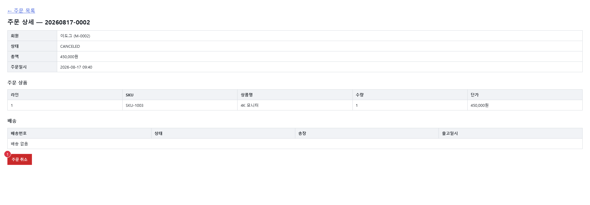

# UIS-ORD-002: 주문 상세

> **근거 소스(권위):** `src/main/resources/templates/order/detail.html` (Thymeleaf 서버 렌더) +
> `src/main/java/com/sm/lab/shop/controller/OrderViewController.java`. 스크린샷은 보조.

## 0. 화면 미리보기

> 원 안 번호 = 「4. 위젯·액션」 표의 번호와 1:1.

## 1. 화면 목적

주문 1건(`orderNo`)의 상태·회원·총액·주문일시와 주문 상품 라인, 배송 이력을 한 화면에서 조회한다.
주문 상태와 무관하게 화면 하단의 「주문 취소」 버튼으로 즉시 취소 요청을 보낼 수 있다.

## 2. 주요 작업 시나리오

**시나리오: 주문 상세 조회**
1. 주문 목록 화면(`/order/list`)에서 특정 주문을 클릭하거나, `/order/{orderNo}` 라우트로 직접 진입한다.
2. 서버(`OrderViewController#orderDetail`)가 `orderService.detail(orderNo)`로 주문 1건을 조회해 화면에 렌더한다(GET 시점에 이미 데이터 확정 — 화면 내 별도 조회 액션 없음).
3. 상단 표에서 회원·상태·총액·주문일시를 확인한다.
4. 「주문 상품」 표에서 라인별 SKU·상품명·수량·단가를 확인한다.
5. 「배송」 표에서 배송 이력(배송번호·상태·송장·출고일시)을 확인한다. 배송 이력이 없으면 "배송 없음" 1행이 표시된다.
6. 목록으로 돌아가려면 상단 「← 주문 목록」 링크로 이동한다.

**시나리오: 주문 취소**
1. 화면 하단 「주문 취소」 버튼(①)을 클릭한다.
2. `PATCH /api/orders/{orderNo}/cancel` 호출 → 완료 시 `location.reload()`로 화면을 재조회해 갱신된 상태(CANCELED 등)를 반영한다.
3. 별도 확인(confirm) 다이얼로그 없이 즉시 요청이 전송된다(소스에 confirm 없음 — 8. 미확인 사항 참고).

## 3. 화면 구성 (블록)

| 블록 | 역할 | 주요 위젯 | 소스 근거 |
|------|------|----------|----------|
| 상단 네비게이션 | 목록 화면으로 복귀 | `← 주문 목록` 링크(href) | `detail.html:18` |
| 주문 요약 표 | 회원/상태/총액/주문일시 표시 | 정적 테이블(위젯 없음) | `detail.html:21-26` |
| 주문 상품 그리드 | 라인별 SKU·상품명·수량·단가 | 반복 테이블(`th:each`) | `detail.html:28-40` |
| 배송 이력 표 | 배송번호·상태·송장·출고일시 | 반복 테이블 + 빈 배열 시 안내행 | `detail.html:42-54` |
| 액션 영역 | 주문 취소 | `#btnCancel` | `detail.html:56-59` |

## 4. 위젯·액션

> 버튼/필드 + **동작 → API(raw) → 결과**. 번호 = 「0. 화면 미리보기」 마커 번호와 1:1.

| 번호 | 위젯 | 타입 | 레이블 | 동작 | 연결 API(raw) | 결과 |
|---|------|------|--------|------|--------------|------|
| (1) | `#btnCancel` | button | 주문 취소 | 현재 주문(`orderNo`) 취소 요청 | PATCH /api/orders/{orderNo}/cancel | 성공 시 `location.reload()`로 화면 재조회·상태 갱신 |

> 「← 주문 목록」 링크(`href="/order/list"`, 정적 앵커)와 상단/상품/배송 표는 인터랙션 위젯(id/onclick)이
> 아니므로 `select_tab_widgets.py` 전수 목록에 포함되지 않는다 — 3번 「화면 구성」에 별도 기록.

## 5. 접근 권한·표시 조건

| 요소 | 표시 조건 | 근거 | 스토리 |
|------|----------|------|---|
| 화면 전체 | 권한 분기 없음 — `/order/{orderNo}` 진입 시 무조건 렌더 | `OrderViewController.java:31-35` |  |
| 「주문 취소」 버튼 | 항상 노출 — 현재 주문 상태(CANCELED 등)에 따른 disabled 분기 없음 | `detail.html:56-59` |  |
| 기본 | (스토리 `주문/주문 상세`의 상태 — 표시 조건은 실물 참조) | stories: ./src/components/OrderDetailCard.stories.tsx | [기본](story:주문-주문-상세--기본) |
| 미출고섞임 | (스토리 `주문/주문 상세`의 상태 — 표시 조건은 실물 참조) | stories: ./src/components/OrderDetailCard.stories.tsx | [미출고섞임](story:주문-주문-상세--미출고섞임) |
| 배송이력없음 | (스토리 `주문/주문 상세`의 상태 — 표시 조건은 실물 참조) | stories: ./src/components/OrderDetailCard.stories.tsx | [배송이력없음](story:주문-주문-상세--배송이력없음) |
| 품목없음 | (스토리 `주문/주문 상세`의 상태 — 표시 조건은 실물 참조) | stories: ./src/components/OrderDetailCard.stories.tsx | [품목없음](story:주문-주문-상세--품목없음) |
| 탈퇴회원 | (스토리 `주문/주문 상세`의 상태 — 표시 조건은 실물 참조) | stories: ./src/components/OrderDetailCard.stories.tsx | [탈퇴회원](story:주문-주문-상세--탈퇴회원) |
| 로딩 | (스토리 `주문/주문 상세`의 상태 — 표시 조건은 실물 참조) | stories: ./src/components/OrderDetailCard.stories.tsx | [로딩](story:주문-주문-상세--로딩) |
| 조회실패 | (스토리 `주문/주문 상세`의 상태 — 표시 조건은 실물 참조) | stories: ./src/components/OrderDetailCard.stories.tsx | [조회실패](story:주문-주문-상세--조회실패) |
| 주문없음 | (스토리 `주문/주문 상세`의 상태 — 표시 조건은 실물 참조) | stories: ./src/components/OrderDetailCard.stories.tsx | [주문없음](story:주문-주문-상세--주문없음) |
| 조회실패다시시도 | (스토리 `주문/주문 상세`의 상태 — 표시 조건은 실물 참조) | stories: ./src/components/OrderDetailCard.stories.tsx | [조회실패다시시도](story:주문-주문-상세--조회실패다시시도) |

## 6. 팝업·연계 화면

팝업 없음(섹션 생략 대상이나 이동 대상만 기록).

| 트리거 위젯 | 팝업/연계 화면 | 연결 API/화면 (raw → INF) | 용도 |
|------------|--------------|--------------------------|------|
| `← 주문 목록` 링크 | 주문 목록 화면 | GET /order/list ← 화면 이동(INF 없음) | 목록으로 복귀 |

## 7. 데이터 출처·연결

- **연결 API(raw → INF):**
  - `GET /order/{orderNo}` — 화면 자체 라우트(서버 렌더 진입점). INF 대상 아님(view 반환, JSON API 아님).
  - `PATCH /api/orders/{orderNo}/cancel` → INF-ORD-006
- **참조 테이블(SCH):** ORDERS, MEMBERS, ORDER_ITEMS, PRODUCTS, ORDER_DELIVERY (INF-ORD-004/006 기준 추정 — 화면 자체는 컨트롤러가 `orderService.detail()` 1회 호출로 전 데이터를 서버 렌더하며, 별도 REST API 조회는 없음)

## 8. 미확인 사항

- 「주문 취소」 버튼에 확인(confirm) 다이얼로그가 없어, 클릭 즉시 PATCH 요청이 전송된다 — 의도된 UX인지 확인 필요.
- 화면 소스(`detail.html`)에는 주문 상태(CANCELED 등)에 따라 「주문 취소」 버튼을 비활성화하는 분기가 없다 — 이미 취소된 주문에서도 버튼이 그대로 노출된다(실제 캡처 상태=CANCELED 화면에서도 버튼 활성 확인). 서버측(`/api/orders/{orderNo}/cancel`) 상태 검증 여부는 이 화면 소스만으로는 미확인.
- `GET /order/{orderNo}` 자체는 화면 라우트라 INF 매칭 대상이 아니며, 실제 데이터 조회 API(`orderService.detail()` 내부 구현)는 이 슬라이스 범위 밖.
