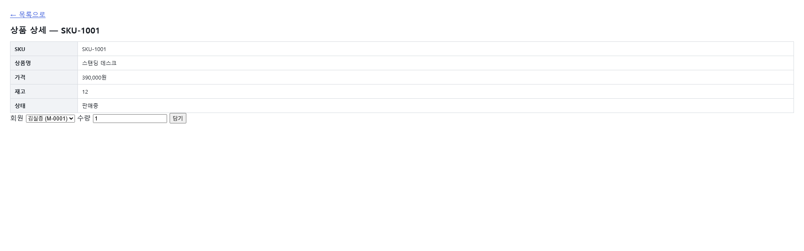

> [변경: SR-202] 2026-08-22
> [변경: SR-202] 2026-08-23 — 담기 폼 반영(FUNC-order-010 r6~r7 구현 실측)

# UIS-ORD-004: 상품 상세

> **근거 소스(권위):** `src/main/resources/templates/product/detail.html` (Thymeleaf 서버 렌더) +
> `src/main/java/com/sm/lab/shop/controller/ProductViewController.java` +
> `src/main/java/com/sm/lab/shop/service/CartService.java`. 스크린샷은 보조.

## 0. 화면 미리보기

> 이 화면은 `select_tab_widgets.py` 기준 마킹 대상 인터랙션 위젯(id·onclick 보유 button/a) 0건이다
> (재검증 완료). 담기 폼의 `select`/`input`/`button`은 실재하지만 소스에 `id`·`onclick` 속성이
> 없어(name 속성만 사용) 결정론 스캐너의 선택 대상이 아니다 — **결함이 아니라 소스 실측**이며,
> 아래 「4. 위젯·액션」에 소스 근거로 전수 기록했다. 유일한 링크(`← 목록으로`)는 상단 공통영역이라
> 3번 「화면 구성」에 기록. 따라서 마커 번호 없음, annotate 생략.

## 1. 화면 목적

상품 1건(`sku`)의 SKU·상품명·가격·재고·상태를 표시하고, 재고가 있으면 같은 화면에서 회원을 선택해
장바구니에 담을 수 있다(SR-202). 담기는 서버 렌더 POST(PRG)로 처리되며, 담기 자체는 재고를
차감하지 않는다(보관 전용). 존재하지 않는 SKU로 접근하면 예외 페이지 대신 "상품을 찾을 수
없습니다" 안내 문구를 보여준다.

## 2. 주요 작업 시나리오

**시나리오: 상품 상세 조회 (정상 SKU)**
1. 상품 목록 화면(`/product/list`, UIS-ORD-003)에서 상품명을 클릭하거나, `/product/{sku}` 라우트로
   직접 진입한다.
2. 서버(`ProductViewController#productDetail` → `loadProduct`)가 `productService.get(sku)`를
   호출해 상품 1건을 조회한다(GET 시점에 이미 데이터 확정 — 화면 내 별도 조회 액션 없음).
3. 표에서 SKU·상품명·가격(`#,###원` 포맷)·재고·상태(재고 0이면 "품절", 그 외 "판매중")를 확인한다.
4. 목록으로 돌아가려면 상단 「← 목록으로」 링크로 이동한다.

**시나리오: 존재하지 않는 SKU로 접근**
1. 등록되지 않은 `sku`로 `/product/{sku}`에 접근한다.
2. `productService.get(sku)`가 던지는 404(`ResponseStatusException`)를 `loadProduct`가 흡수하고
   `product=null`로 모델에 담아 같은 뷰(`product/detail`)를 그대로 반환한다(예외 스택 트레이스
   노출 없음).
3. 화면에는 "상품을 찾을 수 없습니다" 안내 문구만 표시된다(상세 표·담기 폼 없음).
4. 「← 목록으로」 링크는 이 상태에서도 동일하게 노출되어 목록으로 복귀할 수 있다.

**시나리오: 장바구니 담기 (재고 있음, SR-202 실측)**
1. 재고(`stockQty`) > 0인 상품 상세 화면 하단의 담기 폼에서 회원을 선택한다(`memberService.list()`가
   채운 기존 회원 목록 셀렉트).
2. 수량을 입력한다(입력값 기본 1, `min="1"` — 클라이언트 힌트일 뿐 서버가 실검증한다).
3. [담기] 버튼을 클릭하면 `POST /product/{sku}/cart` {memberId, qty}가 제출된다. 컨트롤러는
   회원·수량·재고 판정을 직접 수행하지 않고 `CartService.addItem(memberId, sku, qty)`를 **자바
   메서드로 직접 호출**한다(HTTP 아님, REST `POST /api/cart/items`([[INF-ORD-010]])와는 별도
   경로 — 같은 서비스 계층만 공유).
4. 같은 회원·같은 상품 재담기는 `CartService`가 DB 원자 UPSERT로 수량을 합산한다(D2,
   `CART_ITEMS` PK(member_id, sku)).
5. **성공**: 서버가 `redirect:/product/{sku}`로 302 리다이렉트하며 `RedirectAttributes` 플래시에
   `addToCartSuccess=true`·`addedMemberId`를 담는다. 이어지는 GET 렌더에서 "장바구니에
   담았습니다. 장바구니로 이동" 문구 + `/cart?memberId=...` 링크(UIS-ORD-005, 채번만)가 표시된다.
   플래시는 1회성이라 그 다음 새로고침(F5)에서는 문구가 사라진다.
6. **거부**(400 수량<1 / 404 회원·상품 없음 / 409 재고초과·품절): 동일하게 302 리다이렉트 +
   `addToCartError=<CartService 사유 메시지>` 플래시 → 재렌더 시 사유 문구만 표시(재검증 로직
   없이 서비스 메시지 그대로).
7. 두 경우 모두 F5(새로고침)는 리다이렉트된 **GET**을 재요청할 뿐이라 `CartService.addItem`이
   중복 호출되지 않는다(PRG — QA r6→r7 결정, 아래 §8).

**시나리오: 품절 상품**
1. 재고(`stockQty`) == 0인 상품 상세 화면에서는 담기 폼 자체가 렌더되지 않고, "품절 상품은 담을
   수 없습니다" 안내만 표시된다(폼을 통한 우회 제출은 불가 — 폼이 아예 없음).

## 3. 화면 구성 (블록)

| 블록 | 역할 | 주요 위젯 | 소스 근거 |
|------|------|----------|----------|
| 상단 네비게이션 | 목록 화면으로 복귀 | `← 목록으로` 링크(href, 정상/미존재 양쪽 공통) | `detail.html:20` |
| 상품 상세 표 (정상 SKU) | SKU·상품명·가격·재고·상태 5행 표시 | 정적 테이블(위젯 없음) | `detail.html:29-37` |
| 안내 영역 (미존재 SKU) | "상품을 찾을 수 없습니다" 문구 | 정적 텍스트 | `detail.html:23-26` |
| 담기 성공 안내 | 담기 완료 확인 + 장바구니 이동 링크 (PRG 플래시 1회성) | 안내 텍스트 + `/cart?memberId=...` 링크 | `detail.html:41-45` |
| 담기 거부 사유 안내 | 400/404/409 사유 메시지 표시 (PRG 플래시 1회성) | 안내 텍스트 | `detail.html:49-51` |
| 장바구니 담기 폼 (재고 있음) | 회원 선택 + 수량 입력 후 담기 | 회원 선택 셀렉트, 수량 input(기본1/min1), [담기] 버튼 | `detail.html:54-65` |
| 품절 안내 (재고 0) | 담기 폼 대신 안내 문구, 폼 미노출 | 정적 텍스트 | `detail.html:68-70` |

## 4. 위젯·액션

> **소스 실측**: 담기 폼의 `select`/`input`/`button`은 `id`·`onclick` 속성이 없어(name만 사용)
> `select_tab_widgets.py` 전수 스캔에서 마커 대상이 되지 않는다(0건, 결함 아님 — 위 0번 참고).
> 아래 표는 소스(`detail.html`)를 직접 읽어 도출한 **전수** 기록이다. 마커 번호는 없다.

| 위젯 | 타입 | 레이블 | 동작 | 연결 API(raw) | 결과 |
|------|------|--------|------|--------------|------|
| 회원 선택 (`name="memberId"`) | select | 회원 | `members`(기존 회원 목록) 중 선택 — 옵션 0개(회원 0명)여도 폼은 렌더됨 | — | 선택값 = memberId, 제출 시 `""`이면 CartService 404 |
| 수량 입력 (`name="qty"`) | input(number, min=1, value=1) | 수량 | 서버가 `@RequestParam(defaultValue="1")`로도 기본 1 고정(이중 방어). `min=1`은 클라이언트 힌트일 뿐, 1 미만 제출은 서버(CartService)가 400으로 거부 | — | 입력값 = qty |
| [담기] 버튼 | button(submit) | 담기 | 폼 제출 → `POST /product/{sku}/cart` | POST /product/{sku}/cart | 성공: 302 redirect + flash(성공 문구/장바구니 링크). 거부: 302 redirect + flash(사유). 5xx: 그대로 rethrow(흡수 안 함) |
| 담기 성공 링크 (`장바구니로 이동`) | a | 장바구니로 이동 | 성공 플래시가 있을 때만 렌더, 클릭 시 이동 | GET /cart | UIS-ORD-005(장바구니, 채번만·화면 본문 미저작)로 이동 |
| 거부 사유 텍스트 | text(조건부) | — | `addToCartError != null`일 때만 노출, `CartService`가 던진 `ResponseStatusException.reason`을 그대로 출력(재검증·가공 없음) | — | 400/404/409 사유 메시지 표시 |
| 품절 안내 텍스트 | text(조건부) | — | `stockQty == 0`일 때만 노출(폼 자체가 함께 미노출) | — | "품절 상품은 담을 수 없습니다" |

## 5. 접근 권한·표시 조건

| 요소 | 표시 조건 | 근거 |
|------|----------|------|
| 화면 전체(GET/POST) | 권한 분기 없음 — `/product/{sku}` GET·`/product/{sku}/cart` POST 모두 무조건 처리 | `ProductViewController.java:56-96` |
| 상세 표(5행) | `product != null`(정상 조회된 SKU)일 때만 렌더 | `detail.html:28` |
| "상품을 찾을 수 없습니다" 문구 | `product == null`(404 흡수)일 때만 렌더 — POST에서도 이 경우 `addItem` 호출 없이 즉시 이 문구로 응답(조기 반환) | `detail.html:23`, `ProductViewController.java:78-82` |
| 담기 성공/거부 안내 | 각각 `addToCartSuccess`/`addToCartError != null` — PRG 플래시로 **직후 GET 1회만** 채워짐(그 다음 새로고침엔 사라짐) | `detail.html:41,49` |
| 장바구니 담기 폼 | `product != null && product.stockQty > 0`일 때만 렌더 | `detail.html:54` |
| 품절 안내 | `product != null && product.stockQty == 0`일 때만 렌더(폼과 상호배타) | `detail.html:68` |
| 「← 목록으로」 링크 | 위 모든 분기와 무관하게 항상 노출 | `detail.html:20` |

## 6. 팝업·연계 화면

팝업 없음(화면 이동 대상만 기록).

| 트리거 위젯 | 팝업/연계 화면 | 연결 API/화면 (raw → INF) | 용도 |
|------------|--------------|--------------------------|------|
| `← 목록으로` 링크 | 상품 목록 화면(UIS-ORD-003) | GET /product/list ← 화면 이동(INF 없음) | 목록으로 복귀 |
| 담기 성공 링크(`장바구니로 이동`) | 장바구니 화면(UIS-ORD-005, 채번만 — 화면 본문 미저작) | GET /cart ← 화면 이동(INF 없음) | 방금 담은 장바구니 확인 |

## 7. 데이터 출처·연결

- **연결 API(raw → INF):**
  - `GET /product/{sku}` — 화면 자체 라우트(서버 렌더 진입점). INF 대상 아님(view 반환, JSON API
    아님). 내부적으로 `ProductService.get(sku)`를 **자바 메서드로 직접 호출**한다(HTTP 호출 아님) —
    이 메서드는 REST API 컨트롤러([[INF-ORD-009]] `GET /api/products/{sku}`)와 **동일 서비스
    인스턴스를 공유**하지만, 상세 화면은 그 API를 HTTP로 부르지 않고 같은 서비스 계층을 재사용한다.
  - `POST /product/{sku}/cart` — 담기 폼 제출(서버 렌더 PRG). INF 대상 아님(리다이렉트 응답, JSON
    API 아님). 내부적으로 `CartService.addItem(memberId, sku, qty)`를 **자바 메서드로 직접
    호출**한다(HTTP 호출 아님) — REST API인 [[INF-ORD-010]](`POST /api/cart/items`,
    `CartController`)와 **동일 `CartService` 인스턴스를 공유**하지만, 이 화면은 그 REST API를
    직접 호출하지 않는다(서버사이드 직접 호출로 대체 — 명시적으로 구분해 둔다).
  - `GET /product/list` — 목록 화면 이동. INF 대상 아님.
  - `GET /cart` — 담기 성공 후 이동 링크(장바구니 화면). INF 대상 아님.
- **참조 테이블(SCH):**
  - PRODUCTS ([[SCH-ORD-005]], INF-ORD-009 기준) — `ProductService.get(sku)` 경유.
  - CART_ITEMS — `CartService.addItem`이 `CartDao.upsertMergeQty`로 갱신(REST 측 [[INF-ORD-010]]과
    동일 테이블). **이 화면 기준 SCH 문서는 아직 없음** — 아래 §8 참조.
  - MEMBERS(간접) — 담기 폼의 회원 셀렉트가 `memberService.list()`로 조회.

## 8. 미확인 사항

- **미존재 SKU 응답 코드 불일치 (SR-201 QA 결정 수용, r7까지 유지):** 이 화면은 존재하지 않는
  SKU에 대해 **HTTP 200 + "상품을 찾을 수 없습니다" 안내 문구**를 렌더한다(GET·POST 조기 반환
  양쪽 동일). 반면 같은 자원을 다루는 API [[INF-ORD-009]](`GET /api/products/{sku}`)는 **404**를
  반환한다 — 두 계층의 "미존재" 의미가 일부러 다르게 설계됐다. STORY-FUNC-order-010 QA(r1
  CONCERNS 권고3, r2 재게이트 PASS 시 잔존·수용, r7 재게이트에서도 잔존·수용으로 재확인)에서
  "AC가 상태 코드를 규정하지 않고, 화면단은 사용자 안내가 목적이라 200 렌더가 화면 테스트·구현상
  더 단순하다"는 이유로 **수용(waive)** 결정됨 — 결함이 아니라 화면/API 계층 간 의도된 차이로 기록.
  (근거: `docs/00_FUNC/stories/STORY-FUNC-order-010.md` QA Gate r1 권고3 / r7 잔존 권고1)
- **등록일 미표시 (SR-201 의사결정 D1, 변동 없음):** 요구사항 원문은 등록일 표시를 언급하나,
  `PRODUCTS` 테이블에 등록일 컬럼이 없어(DB 실측: sku·product_name·price·stock_qty·sale_yn
  5개뿐) 이번 범위에서 **제외**했다. "DB 변경 없음" 원칙 유지가 이유이며, 등록일은 상품 등록
  기능이 도입되는 추후 SR에서 컬럼과 함께 재검토한다. (근거:
  `docs/변경관리/SR-201/inputs/_decisions.md` D1)
- **F5 중복 담기 방지 — PRG 채택 근거 (SR-202, QA r6→r7):** r6 QA는 최초 구현이 담기 성공/거부를
  같은 뷰(`product/detail`)로 **재렌더**(200, redirect 없음)해 F5 재제출 시 `cartService.addItem`이
  2회 호출되고 수량이 조용히 누적됨을 프로브로 실측했다(`CART_ITEMS`는 PK UPSERT 합산이라 행
  중복은 없었으나 수량 누적은 사용자 의도와 무관하게 발생). 기존 `CartViewController`(수량변경·
  삭제)가 이미 `redirect:/cart?memberId=...` 관례를 쓰고 있어 이 화면만 예외였던 점도 지적됨(medium
  회귀/UX, 권고2). r7에서 성공·거부 양쪽 모두 `RedirectAttributes` 플래시 + `redirect:/product/{sku}`
  (PRG)로 전환 — 재제출 대상이 POST가 아니라 멱등 GET이 되어 중복 호출이 구조적으로 제거됐다.
  r7 QA 재게이트가 프로브로 재확인: 성공/거부 각각 `addItem` 총 호출 1회, F5 후 플래시 소멸 →
  **PASS**. (근거: `docs/00_FUNC/stories/STORY-FUNC-order-010.md` QA Gate r6 CONCERNS 권고2 /
  r7 재게이트 "권고2(PRG) — 해소")
- **CART_ITEMS의 SCH/추가 INF 문서 미생성(7-N 원칙, D5):** 담기 폼은 구현·QA 완료됐지만, 이 화면이
  경유하는 `CART_ITEMS` 테이블의 SCH 문서와 `POST/GET/PATCH/DELETE /api/cart/...` 4종(D3)의 INF
  중 `POST /api/cart/items`([[INF-ORD-010]])만 이미 존재하고 나머지는 아직 `/sl-recon-inf`·
  `/sl-recon-sch`가 소스에서 역생성하지 않았다. 이 화면 자체는 REST가 아니라 `CartService`를
  직접 호출하므로 INF 신설 대상은 아니나, §7의 `CART_ITEMS` SCH 링크가 비어 있는 이유는 이
  잔여 recon 미실행 때문이다.
- **경계 케이스(잔존, 변동 없음):** 경로 변수 경계 케이스(`/product/` 빈 sku, `/` 포함 sku)는
  이 화면의 친화 안내(200+문구) 대상이 아니라 Spring 기본 404로 빠진다(스택 트레이스 노출 없음) —
  실 SKU 형식(`SKU-####`)에는 해당 없어 조치 불요(QA r2 잔존 권고2, r7까지 무변화). 회원 0명이면
  옵션 0개인 빈 셀렉트 + 살아있는 [담기] 버튼이 렌더되고 제출 시 404("회원 없음")가 표시되는 것,
  폼 우회 요청에서 `memberId` 누락 시 스프링 기본 400이 되는 것도 QA가 실측했으나 랩 데이터상
  실사고 없어 인지 사항으로만 유지된다(QA r6 권고5·6, r7까지 무변화).
