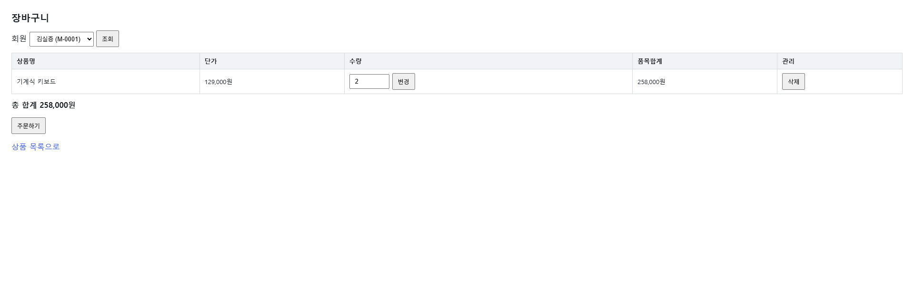

# UIS-ORD-005: 장바구니

> [변경: SR-224] 2026-09-09 — 빈 목록 안내 문구 통일 반영(구현 완료 후 STEP 5.5 재동기화)

> **근거 소스(권위):** `src/main/resources/templates/cart/list.html`(Thymeleaf 서버 렌더) +
> `src/main/java/com/sm/lab/shop/controller/CartViewController.java`. 스크린샷은 보조.

## 0. 화면 미리보기

> 재캡처 시점(FUNC-order-012 구현 완료 후, 장바구니 1품목 상태) 위젯 7개 중 `#selMember`·`#btnSelect`·
> `#btnCheckout` 3개는 `id`를 갖지만, 행별 수량 input·[변경]·[삭제] 버튼 4개는 여전히 `id`·`onclick`이
> 없는 순수 HTML `<form method="post"><button type="submit">` 네이티브 제출 방식이다(JS 바인딩 없음).
> `select_tab_widgets.py`(id/onclick 보유 위젯만 선택) 기준으로는 3개만 걸려 전수 조건을 만족하지
> 못하므로, 이번에도 자동 마커·annotate를 생략하고 **DOM 스냅샷의 위젯 번호(`n`, 1~7)** 를 그대로
> 참조 번호로 사용해 전수 문서화한다(위젯 개수 7 = 아래 4번 표 행 수, 누락 없음).

## 1. 화면 목적

회원별로 서버에 보관된 장바구니(품목·수량·합계)를 조회하고, 그 자리에서 수량을 바꾸거나 품목을
삭제하며, 담긴 품목을 그대로 주문으로 전환(체크아웃)한다. 로그인이 없어 상단 셀렉트로 조회 대상
회원을 고른다. 담기 자체(신규 추가)는 이 화면의 책임이 아니다 — 상품 상세 화면(UIS-ORD-004)에서
담고, 여기서는 이미 담긴 품목만 다루고 주문으로 마무리한다.

## 2. 주요 작업 시나리오

**시나리오: 회원별 장바구니 조회**
1. `/cart` 또는 `/cart?memberId=`로 진입한다. `memberId`를 안 주면 서버가 `MemberService.list()`의
   첫 회원을 기본 선택한다(`CartViewController#cart`).
2. 상단 회원 셀렉트(1)에서 다른 회원을 고르면 `onchange="this.form.submit()"`으로 **즉시 재조회**된다
   (`GET /cart?memberId=...`). [조회] 버튼(2)은 셀렉트를 안 바꾼 상태에서 폼을 다시 제출하고 싶을 때의
   보조 수단이다(JS로 이미 자동 제출되므로 평소엔 클릭할 일이 없다).
3. 품목 표에서 상품명·단가·수량·품목합계를 확인하고, 표 아래 총합계(모든 품목의 `lineTotal` 합)를
   확인한다.

**시나리오: 품목 수량 변경**
1. 해당 행의 수량 입력칸(3)을 원하는 값으로 고친다(`min="1"`).
2. 같은 행의 [변경] 버튼(4)을 누르면 `POST /cart/items/{sku}/update`가 `memberId`(hidden)와 `qty`를
   실어 제출된다.
3. 서버(`CartViewController#updateQty` → `CartService.updateQty`)가 처리 후 `redirect:/cart?memberId=...`
   로 돌아온다(PRG 패턴 — 새로고침 시 중복 제출 없음).
4. 재조회된 화면에서 바뀐 수량·품목합계·총합계를 확인한다. `qty<1`이면 400, 재고 초과면 409로 거부되며
   두 경우 모두 사유 문구는 응답 본문에 담기지만 **이 화면 자체로 재렌더되지 않고 오류 페이지로 이탈**한다
   (8번 참조 — 알려진 한계).

**시나리오: 품목 삭제**
1. 해당 행의 [삭제] 버튼(5)을 누른다. **수량을 0으로 낮춰 사라지게 하는 방식이 아니라 삭제는 반드시
   이 버튼으로만** 한다(SR-202 D4 — 수량 1 미만은 거부하고 삭제 유도는 별도 버튼으로).
2. `POST /cart/items/{sku}/delete`가 `memberId`(hidden)를 실어 제출된다.
3. 서버(`CartViewController#delete` → `CartService.delete`)가 처리 후 `redirect:/cart?memberId=...`.
4. 재조회된 화면에서 해당 행이 사라지고 총합계가 다시 계산된다. 마지막 품목을 지우면 빈 상태로
   전환된다.

**시나리오: 빈 장바구니 → 상품 목록으로 이동**
1. 선택된 회원의 장바구니에 품목이 없으면 표·총합계·[주문하기] 버튼 대신 "조회 결과가 없습니다"
   문구(SR-224 요건① — 화면마다 섞여 있던 빈 목록 문구를 통일. 회원 셀렉트는 검색조건이 아니라
   조회 대상 식별용이라 "조건에 맞는 결과가 없습니다" 변형은 쓰지 않는다, 요건②)와 "상품 목록으로"
   링크가 노출된다(체크아웃 폼은 D6 요구사항대로 품목이 있을 때만 렌더되므로 빈 상태에서는 애초에
   노출되지 않는다).
2. 빈 상태에서 직전 체크아웃 실패(`checkoutError` 플래시)가 함께 있으면 — 예: 이미 빈 장바구니에서
   주문하기를 재제출(중복 submit·뒤로가기 등)한 경우 — "조회 결과가 없습니다" 문구는 **숨고** 상단
   오류 배너("체크아웃 실패: {사유}")만 빈 상태 사유를 알린다. "상품 목록으로" 링크는 이 경우에도
   그대로 노출되어 화면이 막다른 상태(탈출 경로 없음)가 되지 않는다(SR-224 요건③ — 오류로 인한 빈
   목록에는 안내 문구를 쓰지 않는다; `list.html:94-95`).
3. 링크를 클릭하면 `GET /product/list`(UIS-ORD-003)로 이동해 담을 상품을 고른다.
4. 품목이 있는 상태에서는 표·총합계·[주문하기] 버튼 아래에 같은 "상품 목록으로" 링크(7)가 별도로
   한 번 더 노출된다(`list.html:97`) — 추가 담기를 위해 목록으로 돌아가는 용도로 항상 존재.

**시나리오: 체크아웃(주문하기)**
1. 품목이 있는 상태에서만 [주문하기] 버튼(6)이 노출된다(`list.html:77`,
   `th:if="${!#lists.isEmpty(cart['items'])}"`). 빈 장바구니면 이 폼 자체가 렌더되지 않아 버튼을
   누를 수 없다.
2. 버튼(6)을 누르면 `POST /cart/checkout`가 `memberId`(hidden)를 실어 제출된다(PRG 패턴).
3. 서버(`CartViewController#checkout` → `CartService#checkout`)가 해당 회원 장바구니를
   `SELECT ... FOR UPDATE`로 잠근 뒤 전 품목을 사전 스윕(상품없음/판매중지/재고부족)한다. 문제
   없으면 `OrderService.create`로 위임해 재고 차감 + 주문 생성(`ORDERS`/`ORDER_ITEMS` INSERT)을
   같은 트랜잭션에서 처리하고, 트랜잭션 확정 후 장바구니를 비운 뒤 `redirect:/order/{orderNo}`
   (기존 주문 상세 화면)로 이동한다. 재조회하면 장바구니는 빈 상태다.
4. 실패(400 빈 장바구니 · 404 회원 없음 · 409 재고부족/판매중지/상품없음 — 사전 스윕 또는
   `OrderService.create`의 실제 차감 실패로 판정, 전량 거부)면 컨트롤러가 **4xx만 흡수**해
   `redirect:/cart?memberId=...` + flash `checkoutError`로 돌아온다. 화면 상단에 "체크아웃 실패:
   {사유}" 문구가 노출되고(`list.html:28-30`) 장바구니는 그대로 보존된다(트랜잭션 롤백). 409 사유는
   품목별로 모아 `"재고 부족: SKU-1001(가용1/요청2), SKU-1002(판매중지)"` 형태로 한 번에 전달된다
   (D9 — 재고부족+판매중지+미존재 상품을 포괄하는 단일 계열, 접두어는 현행 "재고 부족:"로 통일 전).
   5xx는 흡수하지 않고 그대로 전파된다(장애 은폐 금지).

## 3. 화면 구성 (블록)

| 블록 | 역할 | 주요 위젯 | 소스 근거 |
|------|------|----------|----------|
| 회원 선택 영역 | 조회 대상(장바구니 소유자) 전환 | (1) 회원 셀렉트, (2) 조회 버튼 | `list.html:33-42` |
| 품목 표 (품목 있음) | 상품명·단가·수량·품목합계 표시 + 행별 수량변경/삭제 | (3) 수량 input, (4) 변경, (5) 삭제 (행마다 반복) | `list.html:44-70` |
| 총합계 | 전 품목 합계 표시 | 정적 텍스트(`cart.totalAmount`) | `list.html:71-73` |
| 주문하기 영역 (품목 있음) | 장바구니 전체를 주문으로 전환(체크아웃) | (6) 주문하기 버튼/폼 | `list.html:75-80` |
| 빈 상태 안내 (품목 없음) | "조회 결과가 없습니다"(SR-224 통일 문구, `checkoutError`가 있으면 숨김) + 이동 링크(항상 노출) | 정적 텍스트 + `a` | cart/list.html 빈 상태 블록(라인 앵커는 편집마다 밀려 서술형으로 대체 — round9) |
| 하단 네비게이션 | 상품 목록으로 복귀(품목 있을 때도 항상 노출) | (7) `a` 링크 | `list.html:97` |
| 체크아웃 실패 안내 (실패 후 재진입, 품목 유무 무관) | 직전 체크아웃 실패 사유 표시 — 빈 장바구니에서도 노출 가능(SR-224 요건③으로 빈 상태 안내와 배타) | 정적 텍스트(`checkoutError` flash) | `list.html:27-30` |

## 4. 위젯·액션

> 번호는 「0. 화면 미리보기」에서 설명한 대로 **DOM 스냅샷 위젯 번호(`n`)** 를 그대로 쓴다(annotate 마커
> 아님 — id/onclick 보유 위젯이 3/7뿐이라 자동 선택은 전수를 만족 못 함).

| 번호 | 위젯 | 타입 | 레이블 | 동작 | 연결 API(raw) | 결과 |
|---|------|------|--------|------|--------------|------|
| (1) | `#selMember` | select | 회원 (이름 (ID) 목록) | 회원 전환 시 `onchange`로 자동 제출 | GET /cart | 선택 회원의 장바구니로 재조회 |
| (2) | `#btnSelect` | button(submit) | 조회 | 회원 셀렉트 폼 수동 재제출(백업 수단) | GET /cart | 그리드 갱신(현재 선택 회원 기준) |
| (3) | qty input (행별) | input(number, min=1) | 수량 | 값 수정 | — (같은 행 (4)의 파라미터로 제출) | — |
| (4) | 변경 버튼 (행별) | button(submit) | 변경 | 수량변경 폼 제출(hidden memberId + qty) | POST /cart/items/{sku}/update | redirect:/cart → 수량·품목합계·총합계 갱신. 실패: 400(qty&lt;1)/409(재고초과) |
| (5) | 삭제 버튼 (행별) | button(submit) | 삭제 | 명시적 삭제(D4 — 수량 0 유도 금지) | POST /cart/items/{sku}/delete | redirect:/cart → 해당 행 제거, 총합계 갱신 |
| (6) | `#btnCheckout` | button(submit) | 주문하기 | 체크아웃 폼 제출(hidden memberId) | POST /cart/checkout | 성공: redirect:/order/{orderNo}(장바구니 비워짐). 실패(400/404/409): redirect:/cart+flash `checkoutError`, 장바구니 보존 |
| (7) | `a[href=/product/list]` | a | 상품 목록으로 | 화면 이동 | GET /product/list | 상품 목록(UIS-ORD-003)으로 이동, 담기 재진입 |

## 5. 접근 권한·표시 조건

| 요소 | 표시 조건 | 근거 |
|------|----------|------|
| 회원 셀렉트 옵션 | `MemberService.list()` 전체 회원(권한 분기 없음) | `list.html:36-38`, `CartViewController.java:42` |
| 품목 표 + 총합계 | `cart.items`가 비어있지 않을 때만 렌더 | `list.html:44,71` |
| [주문하기] 버튼/폼(6) | `cart.items`가 비어있지 않을 때만 렌더(D6 — 빈 장바구니는 동작하지 않는다) | `list.html:77` |
| 빈 상태 안내("조회 결과가 없습니다") | `cart.items`가 비어있고 **`checkoutError`가 없을 때만** 렌더(SR-224 요건③ — 오류로 인한 빈 목록에는 이 문구를 쓰지 않는다) | cart/list.html 빈 상태 블록(서술형 참조, round9) |
| 빈 상태 "상품 목록으로" 링크 | `cart.items`가 비어있으면 `checkoutError` 유무와 무관하게 항상 렌더(round8 재작업 — 탈출 링크 소멸 방지) | 위와 동일 위치 |
| 하단 "상품 목록으로" 링크((7)) | `cart.items`가 비어있지 않을 때 별도로 다시 노출(빈 상태 링크와 별개 위치) | `list.html:97` |
| 각 행의 [변경]/[삭제] 폼 | 품목이 존재하는 행마다 항상 노출(권한·상태 분기 없음) | `list.html:52-66` |
| "체크아웃 실패: {사유}" 안내 | 직전 요청의 `checkoutError` 플래시 속성이 있을 때만 렌더(1회성, `cart.items` 유무 무관) | `list.html:27-30` |

## 6. 팝업·연계 화면

팝업 없음. 이동 대상만 기록.

| 트리거 위젯 | 팝업/연계 화면 | 연결 API/화면 (raw → INF) | 용도 |
|------------|--------------|--------------------------|------|
| (7) `a[href=/product/list]` (빈 상태·품목 있음 상태 공통) | 상품 목록 화면(UIS-ORD-003) | GET /product/list ← 화면 이동(INF 없음) | 목록에서 추가 상품 담기(UIS-ORD-004로 이어짐) |
| (6) `#btnCheckout` (성공 시) | 주문 상세 화면(기존, `/order/{orderNo}`) | POST /cart/checkout ← 화면 이동(INF 없음, 대응 REST는 [[INF-ORD-014]]) | 체크아웃 성공 후 생성된 주문 확인 |

## 7. 데이터 출처·연결

- **연결 API(raw → INF):**
  - `GET /cart` — 화면 자체 라우트(서버 렌더 진입점). INF 대상 아님(view 반환). 내부적으로
    `CartService.get(memberId)`를 **자바 메서드로 직접 호출**한다(HTTP 아님).
  - `POST /cart/items/{sku}/update`, `POST /cart/items/{sku}/delete` — 서버렌더 폼 제출(PRG,
    redirect 반환). JSON API가 아니라 INF 대상 아님. 내부적으로 `CartService.updateQty`/`CartService.delete`를
    자바 메서드로 직접 호출하며, 이는 **REST API 컨트롤러(`CartController`)와 동일 서비스 인스턴스를
    공유**한다 — 다만 이 화면은 그 REST API를 HTTP로 부르지 않는다. 같은 서비스가 노출하는 대응 REST
    엔드포인트: 담기 [[INF-ORD-010]](`POST /api/cart/items`), 조회 [[INF-ORD-011]](`GET /api/cart/`),
    수량변경 [[INF-ORD-012]](`PATCH /api/cart/items/{sku}`), 삭제 [[INF-ORD-013]](`DELETE /api/cart/items/{sku}`).
  - `POST /cart/checkout` — 서버렌더 폼 제출(PRG, redirect 반환). JSON API가 아니라 INF 대상 아님.
    내부적으로 `CartService.checkout(memberId)`를 자바 메서드로 직접 호출하며, `OrderService.create`를
    그대로 재사용해 재고 차감·주문 생성을 같은 트랜잭션으로 처리한다(SR-203 D6·D7, 새 주문 규칙 복제
    금지). 같은 비즈니스 로직을 노출하는 대응 REST 엔드포인트: 체크아웃 [[INF-ORD-014]]
    (`POST /api/cart/checkout`) — SR-203에서 신설, 409 응답에 품목별 사유 목록을 담아 전량 거부한다(D9).
  - `GET /product/list` — 목록 화면 이동. INF 대상 아님.
- **참조 테이블(SCH):** `CART_ITEMS`, `PRODUCTS`, `MEMBERS`, `ORDERS`, `ORDER_ITEMS`(INF-ORD-010~014
  `tables` 기준) — 단 **`CART_ITEMS`의 SCH 문서는 아직 생성되지 않았다**(`docs/05_설계서/order/SCH/`에
  SCH-ORD-001~006만 존재, CART_ITEMS 언급 0건) — `/sl-recon-sch` 재실행 대상. `PRODUCTS`는 [[SCH-ORD-005]].

## 8. 미확인 사항

- **REST API(`/api/cart*`)와 화면 폼(`/cart/*`)은 별개 경로다.** 이 화면의 수량변경·삭제·체크아웃은
  브라우저가 직접 REST API(`PATCH`/`DELETE /api/cart/items/{sku}`, `POST /api/cart/checkout`)를
  호출하는 게 아니라, 서버렌더 폼이 `CartViewController`의 자체 라우트로 POST하고 그 안에서
  `CartService`를 자바 메서드로 호출한다. REST API(담기 [[INF-ORD-010]], 조회 [[INF-ORD-011]], 수량변경
  [[INF-ORD-012]], 삭제 [[INF-ORD-013]], 체크아웃 [[INF-ORD-014]])는 별도 클라이언트(외부 연동 등)를
  위한 것으로 보이며 같은 비즈니스 로직을 공유할 뿐 이 화면이 호출하는 경로가 아니다 — 두 계층을
  혼동하지 않도록 api_hints도 화면 경로(`/cart/*`) 위주로 담았고, 체크아웃 REST 대응만 SR-203 지시에
  따라 예외적으로 `POST /api/cart/checkout`을 api_hints에 병기했다(INF-ORD-014 역참조 연결용).
- **폼 오류 시 Whitelabel 이탈(QA r1~r3 CONCERNS, 잔존 이월 — 수량변경/삭제 한정):** `qty<1`(400) 또는
  재고 초과(409)로 수량변경이 실패하면 이 화면으로 재렌더되지 않고 Spring 기본 오류 페이지
  (Whitelabel)로 이동한다. 사유 문구 자체는 응답 본문에 정상 전달되지만(`server.error.include-message:
  always`), 장바구니 화면 컨텍스트는 유지되지 않는다. **체크아웃(SR-203)은 이 문제를 겪지 않는다** —
  `CartViewController#checkout`이 4xx를 명시적으로 흡수해 `redirect:/cart` + flash로 화면 컨텍스트를
  보존하도록 새로 구현됐다. QA에서 권고로 남기고 수용됨(`STORY-FUNC-order-011.md` 후속 추적 TODO) —
  수량변경/삭제까지 화면 재렌더+사유 표시로 확장하는 것은 이번 범위 밖.
- **CSRF 미방어(D3/QA 결정 수용):** `/cart/items/{sku}/update`·`/cart/items/{sku}/delete`·
  `/cart/checkout`은 앱 전역에 spring-security가 없어 CSRF 토큰이 없다. 사람 코멘트로 이번 SR 범위에서
  명시 수용됐고 후속 SR/KNOWN_LIMITATIONS 등재가 후속 추적 TODO로 남아 있다(`STORY-FUNC-order-011.md`
  참조).
- **수량 1 미만은 거부만, 삭제 유도 없음(D4):** `qty<1` 입력 시 자동으로 삭제 처리되지 않고 400으로
  거부된다 — 사용자가 품목을 없애려면 반드시 (5) [삭제] 버튼을 눌러야 한다. 소스 주석
  (`list.html:57` 대응 원칙)에도 이 원칙이 명시돼 있다.
- **`CART_ITEMS` SCH 미생성:** 7번 참조 — 이번 UIS 재작성 시점에도 아직 없어 테이블명만 기록했다.
  `/sl-recon-sch` 재실행 대상.
- **409 메시지 접두어 통일 미완(D9):** 체크아웃 409는 재고부족·판매중지·미존재 상품을 포괄하는 단일
  사유 계열로 확정됐으나, 현재 구현은 세 사유 모두 "재고 부족:" 접두어를 그대로 쓴다(예: 판매중지
  품목도 "재고 부족: SKU-x(판매중지)"로 표기). 메시지 접두어 자체를 통일하는 것은 후속 추적(비차단,
  D9).
